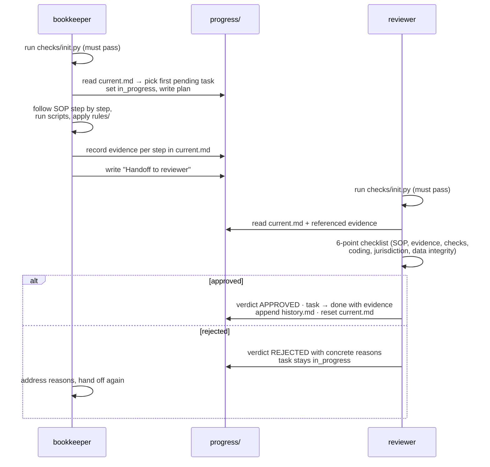

# Architecture

How the repo fits together and how a task flows through it. Read this once;
after that, the repo map in `AGENTS.md` is enough for day-to-day navigation.

## Layers

```
┌─────────────────────────────────────────────────────────────┐
│  ORCHESTRATION      AGENTS.md · .claude/agents/ · hooks     │  who does what, in which order
├─────────────────────────────────────────────────────────────┤
│  PROCESS KNOWLEDGE  docs/sops/ · docs/CONTROLS.md           │  how work must be done
│                     docs/CONVENTIONS.md                     │
├─────────────────────────────────────────────────────────────┤
│  COMPANY CONFIG     rules/coding-rules.yaml                 │  what is specific to
│                     rules/jurisdiction.yaml · data/         │  this company & country
├─────────────────────────────────────────────────────────────┤
│  TOOLS              scripts/ (reconcile, classify, SAF-T)   │  deterministic helpers
├─────────────────────────────────────────────────────────────┤
│  VERIFICATION       checks/ · tests/ · init.sh              │  is the harness intact?
├─────────────────────────────────────────────────────────────┤
│  STATE & EVIDENCE   progress/ (current, tasks, history)     │  file-based memory
└─────────────────────────────────────────────────────────────┘
```

Only the **COMPANY CONFIG** layer (plus `docs/sops/`) changes when the template
is instantiated for a real company. Everything else is generic machinery.

## How a task flows



The same flow applies to the explorer, except its output is documentation
(`docs/`, jurisdiction profile drafts) rather than processed data.

Agents share **no memory**: everything crosses role boundaries through files in
`progress/`. This is deliberate — it makes every handoff auditable and lets any
agent (or human) resume from a crash by reading state.

This flow governs work done *with* the harness. Changes to the harness itself
(`checks/`, `scripts/`, `tests/`, `.github/`, `.claude/`, `AGENTS.md`,
`README.md`) are ordinary software changes: branch, CI green, review before
merge, and no entry in `progress/tasks.json`. See AGENTS.md §2.1.

## Scripts

Deterministic tools, stdlib + pandas + pyyaml only, no network, no API calls:

| Script | Input | Output |
|---|---|---|
| `scripts/bank_reconcile.py` | bank statement CSV + ledger CSV | matched pairs (exact / date-tolerance), unmatched items, summary |
| `scripts/invoice_classify.py` | invoices CSV + `rules/coding-rules.yaml` | proposed account, cost center, confidence, `needs_review` flag |
| `scripts/saft_validate.py` | SAF-T Financial XML | structural validation report, per-transaction balance check |

All three: `--help` for usage, report to stdout, `--output` to save the report
as an evidence file (conventionally under `progress/`).

### LLM extension point

`invoice_classify.py` contains a documented stub, `llm_propose()`, where a
language model can be plugged in for invoices the rules cannot code confidently.
The contract is fixed: the model returns a **proposal with a confidence level**,
which flows through the same threshold and review path as rule-based proposals
(control C-08). The LLM suggests; the human decides. The template itself makes
no API calls.

## Checks

`checks/run_all.py` runs, in order:

1. `check_structure.py` — mandatory files exist and have the expected format.
2. `check_progress.py` — `tasks.json` is valid; nothing `done` without
   evidence; `current.md` consistent with task statuses.
3. `check_jurisdiction.py` — active jurisdiction profile is complete and
   consistent.

`checks/init.py` wraps the full verification: environment (Python ≥ 3.11,
dependencies) → `run_all` → `pytest -q` → OK/FAIL summary, non-zero exit on any
failure. `init.sh` is a thin POSIX wrapper around it; the `.claude` SessionEnd
hook calls it directly so it works on Windows too.

**Adding a check:** create `checks/check_<name>.py` exposing
`run(root: Path) -> list[str]` (empty list = pass) and add it to the `CHECKS`
list in `run_all.py`.

## Jurisdiction handling

The core is jurisdiction-agnostic. Country specifics (chart-of-accounts
standard, statutory export format, VAT cadence, e-invoicing standard, retention,
deadlines) are **declared** in `rules/jurisdiction.yaml` and consulted at
runtime — never hard-coded. The one deliberate exception:
`scripts/saft_validate.py` is a worked example of a jurisdiction-specific check
(Norwegian SAF-T Financial). To support another country, add a profile to
`jurisdiction.yaml` (explorer drafts it, reviewer approves) and, if needed, a
country-specific validator alongside the SAF-T example.
